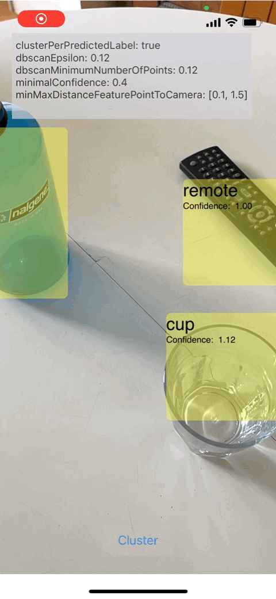
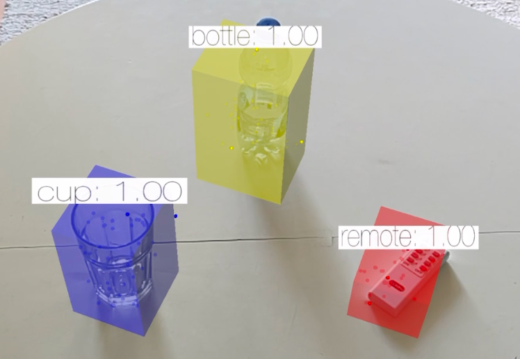
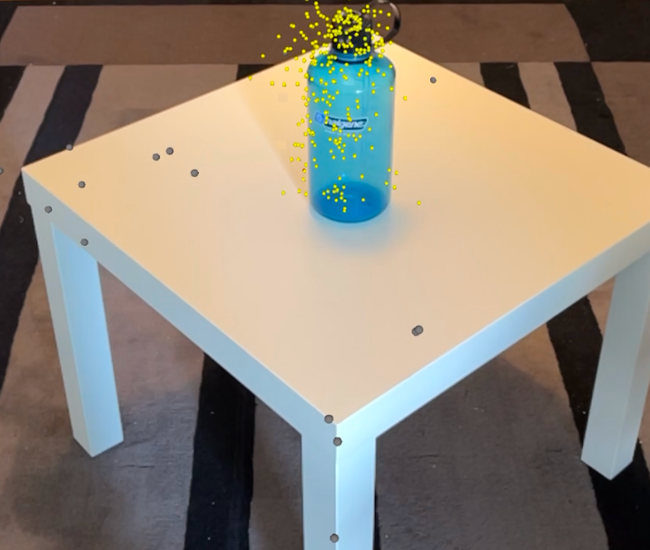

# 3D Object Detection
Detecting objects in 3D environments and visualizing them in augmented reality. Built without the use of depth sensors and local computation only. Developed in Swift, Apple ARKit, and Vision framework.

<b>Demo</b>

  

  

Objects are detected and represented by bounding boxes around real-world objects. Each has a confidence score and feature points that match it.

  

The visualized feature points are highlighted by color: noise is gray, and the belonging cluster is yellow.

